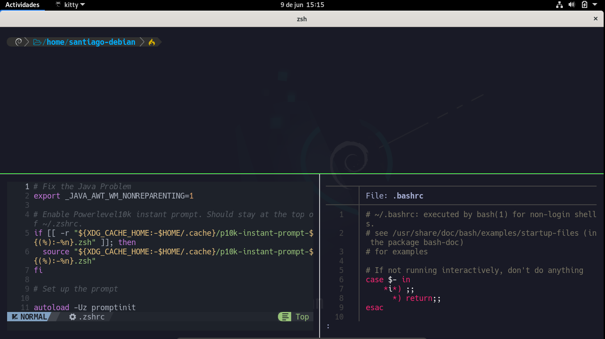

## Descripción

Configuración de la terminal Kitty para distribuciones Linux con las Hack Nerd Fonts, la Powerlevel10K, y una zsh como shell. Además del editor de texto nvim con el tema de [Nvchad](https://nvchad.com/) y el plugin fzf.

## Resultado final 



## Instalación

1. Actualización de paquetes: en primer lugar se actualizará todos los paquetes del sistema con el siguiente comando.

```bash
sudo apt update && sudo apt upgrade
```

2. Instalación de paquetes necesarios: ahora se instalará los paquetes necesarios.

<table style="width:100%">
<tr>
<td>
kitty 
</td>
<td>
zsh 
</td>
<td>
zsh-syntax-highlighting
</td>
</tr>
<tr>
<td>
git 
</td>
<td>
bat 
</td>
<td>
zsh-autosuggestions
</td>
</tr>
</table>

```bash
sudo apt install kitty zsh zsh-syntax-highlighting zsh-autosuggestions bat git -y
```

3. Instalación de las _Hack Nerd Fonts_: como **usuario privilegiado (root)** nos dirigimos al directorio _/usr/share/fonts_ (o el equivalente en la distribución de trabajo) y descargamos el comprimido de las _Hack Nerd Fonts_ de la página oficial ([Hack Nerd Fonts](https://www.nerdfonts.com/)), posteriormente descomprimimos el archivo _.zip_ y lo eliminamos.

```bash
cd /usr/share/fonts
wget https://github.com/ryanoasis/nerd-fonts/releases/download/v3.0.2/Hack.zip
unzip Hack.zip
rm Hack.zip
```

4. Cambio de shell: ahora cambiamos el tipo de shell por defecto para el usuario _root_ y los usuarios con bajos privilegios.

```bash
usermod --shell /usr/bin/zsh root
usermod --shell /usr/bin/zsh <usuario_de_bajos_privilegios>
```

5. Configuración del archivo ***.zshrc***: como usuario **no privilegiado** editamos (o creamos en caso de no existir) el archivo ubicado en la ruta *~/.zshrc*, eliminamos cualquier contenido en caso de existir y pegamos el siguiente contenido.
	**Nota**: el archivo .zshrc está disponible en este repositorio

```bash 
# Fix the Java Problem
export _JAVA_AWT_WM_NONREPARENTING=1

# Enable Powerlevel10k instant prompt. Should stay at the top of ~/.zshrc.
if [[ -r "${XDG_CACHE_HOME:-$HOME/.cache}/p10k-instant-prompt-${(%):-%n}.zsh" ]]; then
  source "${XDG_CACHE_HOME:-$HOME/.cache}/p10k-instant-prompt-${(%):-%n}.zsh"
fi

# Set up the prompt

autoload -Uz promptinit
promptinit
prompt adam1

setopt histignorealldups sharehistory

# Use emacs keybindings even if our EDITOR is set to vi
bindkey -e

# Keep 1000 lines of history within the shell and save it to ~/.zsh_history:
HISTSIZE=1000
SAVEHIST=1000
HISTFILE=~/.zsh_history

# Use modern completion system
autoload -Uz compinit
compinit

zstyle ':completion:*' auto-description 'specify: %d'
zstyle ':completion:*' completer _expand _complete _correct _approximate
zstyle ':completion:*' format 'Completing %d'
zstyle ':completion:*' group-name ''
zstyle ':completion:*' menu select=2
eval "$(dircolors -b)"
zstyle ':completion:*:default' list-colors ${(s.:.)LS_COLORS}
zstyle ':completion:*' list-colors ''
zstyle ':completion:*' list-prompt %SAt %p: Hit TAB for more, or the character to insert%s
zstyle ':completion:*' matcher-list '' 'm:{a-z}={A-Z}' 'm:{a-zA-Z}={A-Za-z}' 'r:|[._-]=* r:|=* l:|=*'
zstyle ':completion:*' menu select=long
zstyle ':completion:*' select-prompt %SScrolling active: current selection at %p%s
zstyle ':completion:*' use-compctl false
zstyle ':completion:*' verbose true

zstyle ':completion:*:*:kill:*:processes' list-colors '=(#b) #([0-9]#)*=0=01;31'
zstyle ':completion:*:kill:*' command 'ps -u $USER -o pid,%cpu,tty,cputime,cmd'

# To customize prompt, run `p10k configure` or edit ~/.p10k.zsh.
[[ -f ~/.p10k.zsh ]] && source ~/.p10k.zsh

# Manual configuration

PATH=/root/.local/bin:/snap/bin:/usr/sandbox/:/usr/local/bin:/usr/bin:/bin:/usr/local/games:/usr/games:/usr/share/games:/usr/local/sbin:/usr/sbin:/sbin:/usr/local/bin:/usr/bin:/bin:/usr/local/games:/usr/games

# Manual aliases
alias ll='lsd -lh --group-dirs=first'
alias la='lsd -la --group-dirs=first'
alias l='lsd --group-dirs=first'
alias lla='lsd -lha --group-dirs=first'
alias ls='lsd --group-dirs=first'
alias cat='batcat'

[ -f ~/.fzf.zsh ] && source ~/.fzf.zsh

# Plugins
source /usr/share/zsh-syntax-highlighting/zsh-syntax-highlighting.zsh
source /usr/share/zsh-autosuggestions/zsh-autosuggestions.zsh
source /usr/share/zsh-sudo/sudo.plugin.zsh

# Functions
function mkt(){
	mkdir {nmap,content,exploits,scripts}
}

# Extract nmap information
function extractPorts(){
	ports="$(cat $1 | grep -oP '\d{1,5}/open' | awk '{print $1}' FS='/' | xargs | tr ' ' ',')"
	ip_address="$(cat $1 | grep -oP '\d{1,3}\.\d{1,3}\.\d{1,3}\.\d{1,3}' | sort -u | head -n 1)"
	echo -e "\n[*] Extracting information...\n" > extractPorts.tmp
	echo -e "\t[*] IP Address: $ip_address"  >> extractPorts.tmp
	echo -e "\t[*] Open ports: $ports\n"  >> extractPorts.tmp
	echo $ports | tr -d '\n' | xclip -sel clip
	echo -e "[*] Ports copied to clipboard\n"  >> extractPorts.tmp
	cat extractPorts.tmp; rm extractPorts.tmp
}

# Set 'man' colors
function man() {
    env \
    LESS_TERMCAP_mb=$'\e[01;31m' \
    LESS_TERMCAP_md=$'\e[01;31m' \
    LESS_TERMCAP_me=$'\e[0m' \
    LESS_TERMCAP_se=$'\e[0m' \
    LESS_TERMCAP_so=$'\e[01;44;33m' \
    LESS_TERMCAP_ue=$'\e[0m' \
    LESS_TERMCAP_us=$'\e[01;32m' \
    man "$@"
}

# fzf improvement
function fzf-lovely(){

	if [ "$1" = "h" ]; then
		fzf -m --reverse --preview-window down:20 --preview '[[ $(file --mime {}) =~ binary ]] &&
 	                echo {} is a binary file ||
	                 (bat --style=numbers --color=always {} ||
	                  highlight -O ansi -l {} ||
	                  coderay {} ||
	                  rougify {} ||
	                  cat {}) 2> /dev/null | head -500'

	else
	        fzf -m --preview '[[ $(file --mime {}) =~ binary ]] &&
	                         echo {} is a binary file ||
	                         (bat --style=numbers --color=always {} ||
	                          highlight -O ansi -l {} ||
	                          coderay {} ||
	                          rougify {} ||
	                          cat {}) 2> /dev/null | head -500'
	fi
}

function rmk(){
	scrub -p dod $1
	shred -zun 10 -v $1
}

# Finalize Powerlevel10k instant prompt. Should stay at the bottom of ~/.zshrc.
(( ! ${+functions[p10k-instant-prompt-finalize]} )) || p10k-instant-prompt-finalize
```
_Créditos: [s4vitar](https://github.com/s4vitar)_

6. Instalación del plugin _sudo_: como **usuario privilegiado (root)** creamos una carpeta llamada _zsh-sudo_ en el directorio _/usr/share_, posteriormente ingresamos a dicha carpeta y descargamos el plugin [zsh sudo](https://github.com/ohmyzsh/ohmyzsh/blob/master/plugins/sudo/sudo.plugin.zsh).

```bash 
mkdir /usr/share/zsh-sudo
cd /usr/share/zsh-sudo
wget https://raw.githubusercontent.com/ohmyzsh/ohmyzsh/master/plugins/sudo/sudo.plugin.zsh
```

7. Instalación de _lsd_: el paquete de _lsd_ esta disponible como paquete en varias distribuciones de linux [(consulta aquí)](https://github.com/lsd-rs/lsd), en el caso de Debian, es necesario descargar el archivo ***lsd_0.23.1_amd64.deb*** y realizar la instalación manual. Los siguientes comando se deben ejecutar como **usuario privilegiado (root)**.

```bash
su root
wget https://github.com/lsd-rs/lsd/releases/download/0.23.1/lsd_0.23.1_amd64.deb
dpkg -i lsd_0.23.1_amd64.deb 
rm lsd_0.23.1_amd64.deb
```

8. Configuración de la kitty: para configurar la kitty se deben crear dos archivos (_kitty.conf_ y _color.ini_) en la ruta _~/.config/kitty_ con el siguiente contenido. 
	**Nota**: los archivos están disponibles en este repositorio.

###### kitty.conf

```bash
enable_audio_bell no

include color.ini

font_family		HackNerdFont
font_size 13

disable_ligatures never

url_color #61afef

url_style curly

# navegar entre ventanas
map ctrl+left neighboring_window left
map ctrl+right neighboring_window right
map ctrl+down neighboring_window down
map ctrl+up neighboring_window up

# Clipboard
map f1 copy_to_buffer a
map f2 paste_from_buffer a
map f3 copy_to_buffer b
map f4 paste_from_buffer b

# Cursor
cursor_shape beam
cursor_beamthickness 1.8

# Customs

mouse_hide_wait 3.0
detect_urls yes
repaint_delay 10
input_delay 3
sync_to_monitor yes


# Powerline
tab_bar_style powerline
inactive_tab_background #e06c75
active_tab_background #98c379
inactive_tab_foreground #000000
tab_bar_margin_color black

# Nuevas ventanas arrastrando el direcctorio
map ctrl+shift+enter new_window_with_cwd
map ctrl+shift+t new_tab_with_cwd

# Opacidad

background_opacity 0.95

shell zsh 
```

###### color.ini

```bash
window_padding_width 10

# special

foreground #a9b1d6
background #1a1b26

# Black 
color0 #414868
color8 #414868

#Red
color1 #f7768e
color9 #f7768e

#Green
color2 #73daca
color10 #73daca

#Yellow
color3 #e0af68
color11 #e0af68

#Blue
color4 #7aa2f7
color12 #7aa2f7

#Magenta
color5 #bb9af7
color13 #bb9af7

#Cyan
color6 #7dcfff
color14 #7dcfff

#White
color7 #c0caf5
color15 #c0caf5

#Cursor
cursor #c0caf5
cursor_text_color #1a1b26 

#Selectionhighlight
selection_foreground #7aa2f7
selection_background #28344a
```

9. Instalación de la Powerlevel10K:  en el repositorio [powerlevel10k](https://github.com/romkatv/powerlevel10k) se encuentra las instrucciones para el proceso de instalación manual de la powerlevel10k.
	**Nota**: esto de debe ejecutar como **usuario no privilegiado**.

```bash
git clone --depth=1 https://github.com/romkatv/powerlevel10k.git ~/powerlevel10k
```

Una vez ejecutados los anteriores comandos se procede a la configuración de la powerlevel10k.

```bash
zsh 
```
<a name="confi_p10k"></a>
###### Mi configuración
- Prompt style: 2 (Classic)
- Character set: 1 (Unicode)
- Prompt color: 3 (Dark)
- Show current time: n (No)
- Prompt separators: 1 (Angled)
- Prompt heads: 1 (Sharp)
- Prompt tails: 5 (Round)
- Prompt height: 1 (One line)
- Prompt spacing: 2 (Sparse)
- Icons: 2 (Many icons)
- Prompt flow: 2 (Fluent)
- Enable transient prompt: yes
- Instant prompt mode: 1 (Verbose)

10. Ajustes adicionales a la powerlevel10k: se debe comentar las líneas 45-109 del archivo ***.p10k.zsh*** , además añade lo siguiente debajo de la línea 36.

```bash 
command_execution_time
context
```

11. Link simbólico para para el archivo ._zshrc_ de root: ahora se realiza un link simbólico para que el archivo _.zshrc_ de root sea el mismo que el del usuario de bajos privilegios. El comando sigueinte se debe ejecutar como **usuario privilegiado (root)**.

```bash
ln -s -f /home/<usuario>/.zshrc /root/.zshrc
```

12. Instalación de la powerlevel10k para root:  ahora se realizará la configuración de la powerlevel10k para el usuario root  de la siguiente manera.  El comando sigueinte se debe ejecutar como **usuario privilegiado (root)**.

```bash
git clone --depth=1 https://github.com/romkatv/powerlevel10k.git ~/powerlevel10k
pk10 configure
```

Y ahora debe repetir la configuración realizada en el [paso 9](#Mconfi_p10k). 

13. Ajustes adicionales a la powerlevel10k: se debe comentar las líneas 45-109 del archivo ***.p10k.zsh*** del directorio root (/root/.p10k.zsh) , además añade lo siguiente debajo de la línea 36.

```bash 
command_execution_time
context
````

Además,  comenta la línea 913 y edita el icono de la línea 900 (escoge uno en la [sección de iconos](https://www.nerdfonts.com/cheat-sheet) de la página Nerdfonts)

14. Instalación de la fzf: en el repositorio [fzf](https://github.com/junegunn/fzf) está el proceso de instalación usando git, este proceso se debe ejecutar para **los usuarios con bajos y altos privilegios (ambos)**.

```bash
git clone --depth 1 https://github.com/junegunn/fzf.git ~/.fzf
~/.fzf/install
```

En el proceso de instalación se da la opción "yes" en todos los casos. 

15. Instalación de Nvchad: para esta instalación se requiere **neovim 0.9.0**, se descarga [aquí](https://github.com/neovim/neovim/releases/tag/v0.9.0), una vez se descargue el binario ejecutable asegúrese que el binario _nvim_ este en una ruta del PATH (recomendada /usr/bin/) y además que el binario cuente con el permiso 755.

```bash
su root
cd /usr/bin
mv /home/<usuario>/Descargas/nvim.appimage ./nvim
chmod 755 nvim
```

Posteriormente, se instalan los siguientes paquetes.

```bash
sudo apt install build-essential nodejs npm
```

Finalmente se debe seguir las [instrucciones de instalación](https://nvchad.com/docs/quickstart/install) de la página oficial de Nvchad. Este comando se debe ejecutar para  **los usuarios con bajos y altos privilegios (ambos)**.

```bash
git clone https://github.com/NvChad/NvChad ~/.config/nvim --depth 1 && nvim
```

## Lista de shortcuts 

- ctrl + shift + enter  => Abre una nueva terminal 
- ctrl + <flechas de dirección>  => Desplazamiento entre ventanas 
- ctrl + shift + w  => Cierra la pestaña actual 
- ctrl + shift + r  => Cambia de tamaño las ventanas
- ctrl + shift + l  => Alterna entre los diferentes layouts 
- ctrl + shift + t  => Nueva terminal en la powerline 
- ctrl + shift + alt + t  => Renombra la terminal actual de la powerline
- ctrl +s hift + ,.  => Cambia de posición las pestañas de la powerline
- ctrl + t  => Busqueda recursiva
- ctrl + r  => Historial de comandos 
- ctrl + alt+ clic  => Selecciona en formato cuadrado
- f1  => Copia a un buffer a
- f2  => Pega el contenido del buffer a
- f3  => Copia a un buffer b
- f4  => Pega el contenido del buffer b
